# 📚 ENT - Digital Work Environment

Welcome to **ENT**, an interactive e-learning platform designed to enhance the online learning experience. This project allows teachers to manage their courses and students to easily access educational resources.

## 📸 SmartSchool platform preview

### Logo


### Screenshots

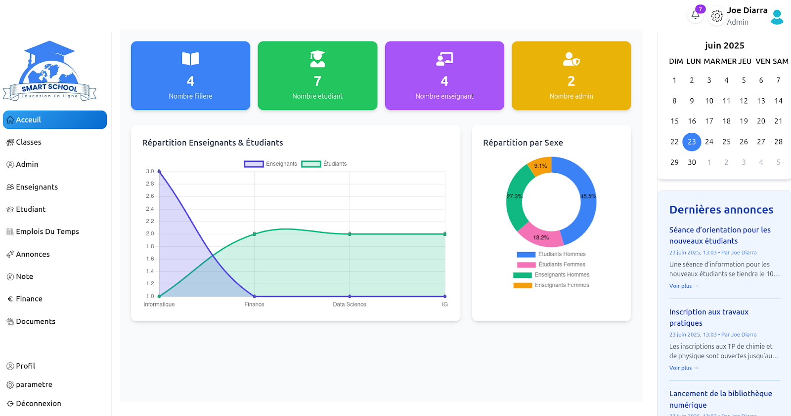

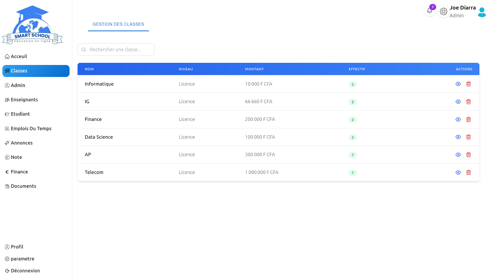
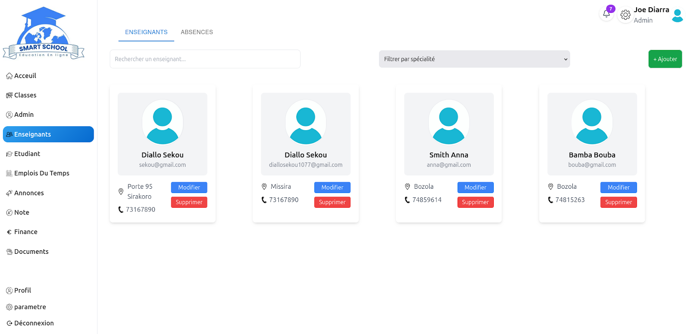
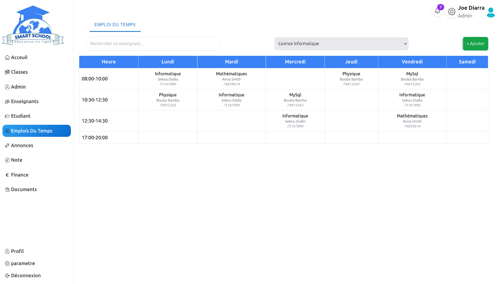
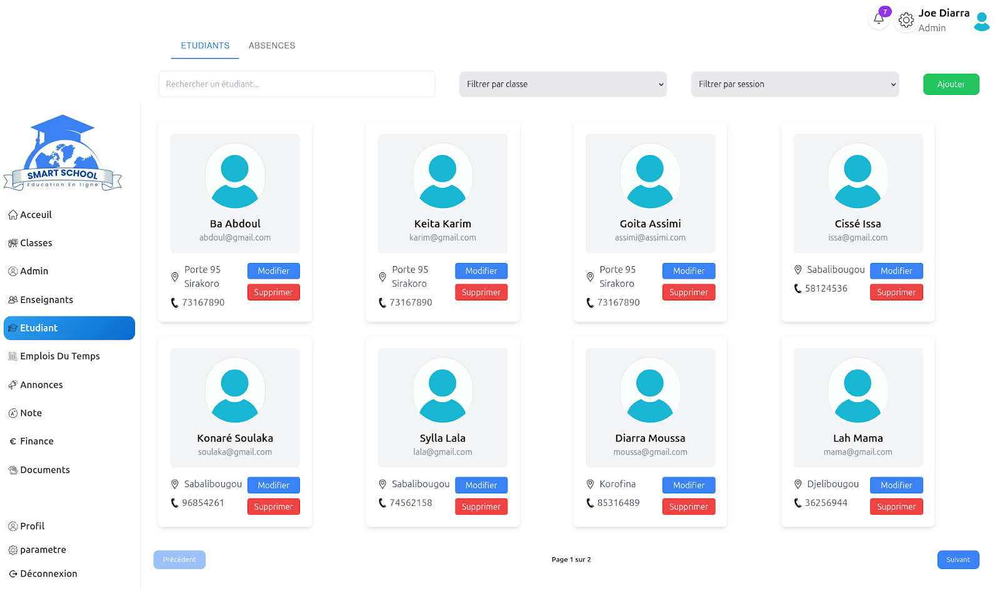
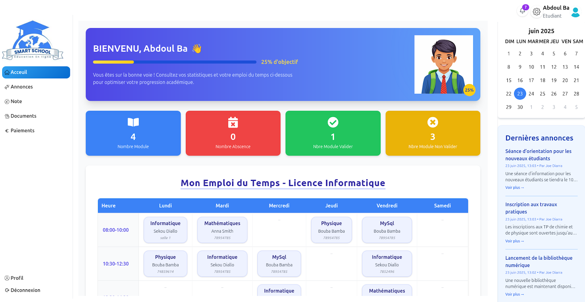
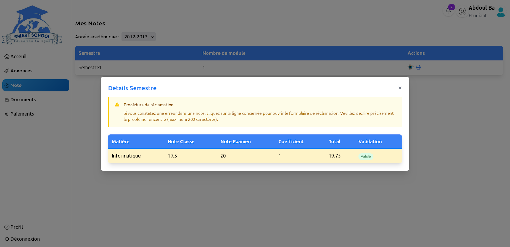
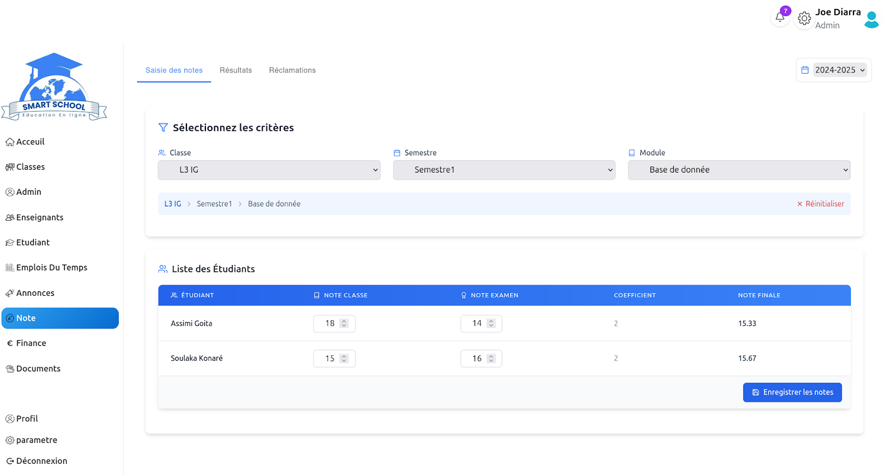
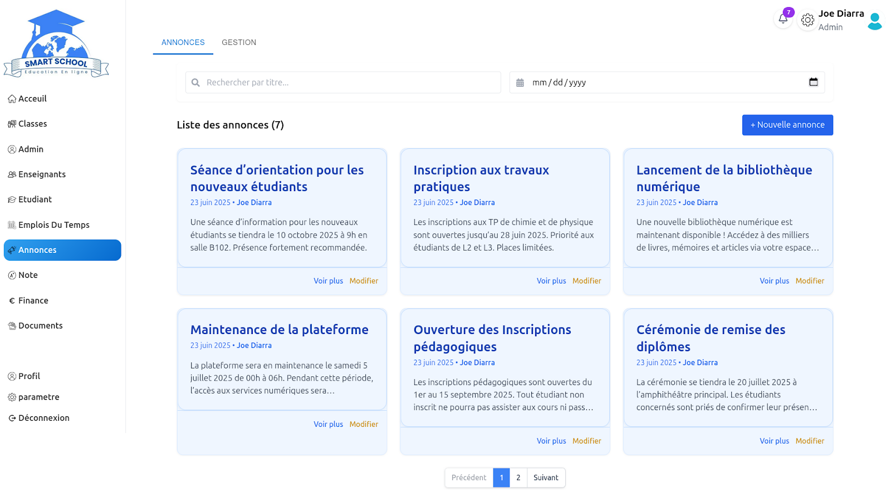
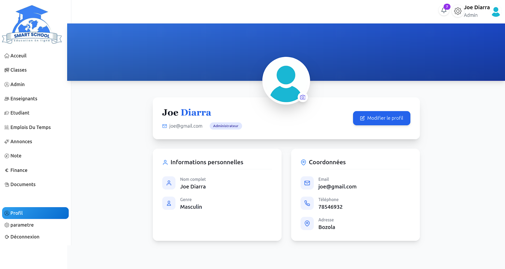
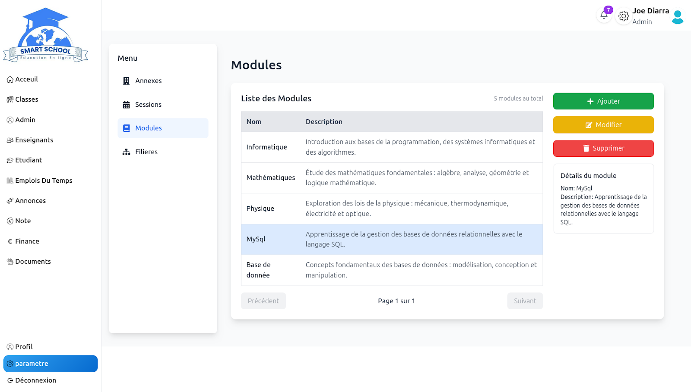
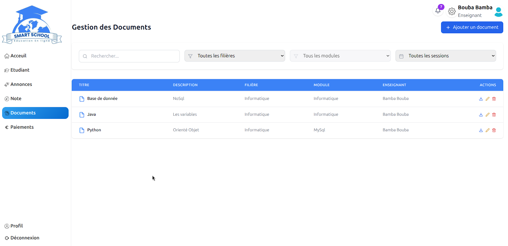
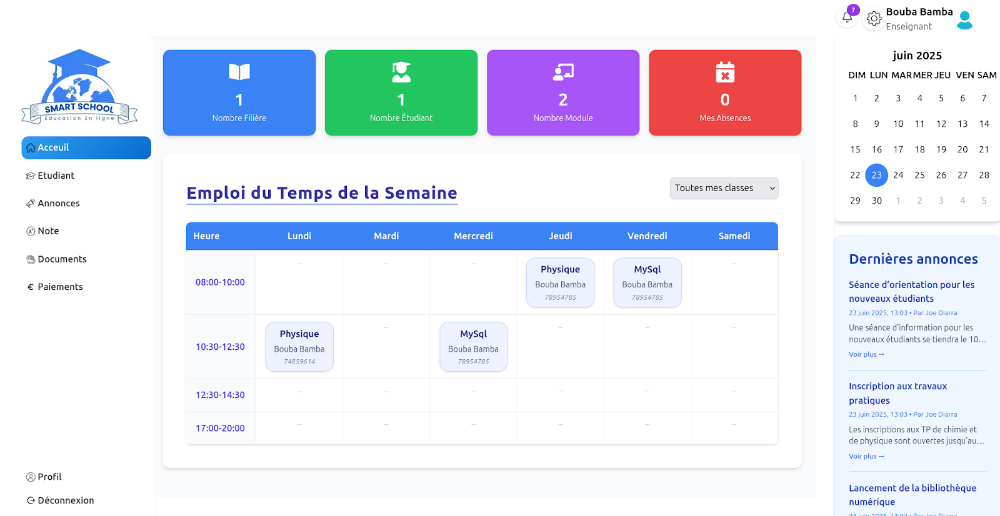
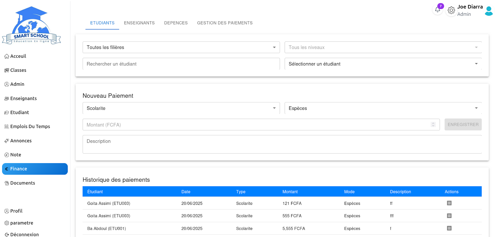

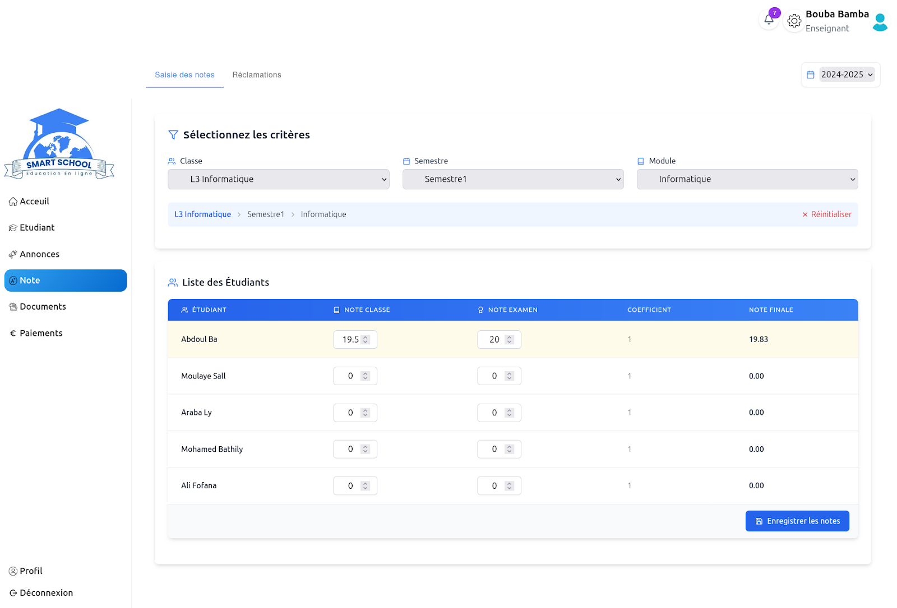

## 🚀 Key features

- 🔐 **Secure authentication** (registration, login, role management)
- 📚 **Course management** (creation, modification, deletion)
- 🎥 **Display and follow-up of training videos**
- 📝 **Interactive quiz system**
- 📊 **Tracking student progress**
- 💬 **Discussion forum** for the exchange between learners and teachers

## 🛠️ Technologies used

- **Framework**: Next.js
- **Frontend**: React, Tailwind CSS
- Backend: Next.js API Routes, Prisma
- **Database**: MySQL
- **Authentication**: NextAuth.js

## 📥 Installation

### 📌 Prerequisites

- **Node.js 18+**
- **MySQL or MongoDB database configured**
- **Prisma installed**

### 🔧 Installation steps

1. **Clone Project**

```bash
git clone https://github.com/ton-utilisateur/ENT.git
cd ENT
```
2. **Install dependencies**
    '''bash npm install'''
3. **Configure the environment**
   Create a '.env.local' file at the root of the project and add:
   DATABASE_URL="votre_url_de_base_de_donnees"
    NEXTAUTH_SECRET="votre_secret"
4. **Run database migrations**
```bash
 npx prisma migrate dev --name init
```
5. **Launch the application**
```bash
 npm run dev
```
## 📅 Roadmap
 - [ ] Finalization of the authentication system
 - [ ] Addition of advanced course management
 - [ ] Integration of an administrator dashboard
 - [ ] Improvement of the UX/UI
## 🤝 Contribution Contributions are welcome!
 - [ ] 1. Forking the repo
 - [ ] 2. Create a branch ('git checkout -b feature-xyz')
 - [ ] 3. Commit your changes ('git commit -m 'Adding a new feature')
 - [ ] 4. Push Branch ('git push origin feature-xyz')
 - [ ] 5. Open a Pull Request
## 📜 License

This project is licensed under the MIT License. See [LICENSE](LICENSE) for more information.

---

✨ _This project is actively being developed, stay tuned for updates!_
